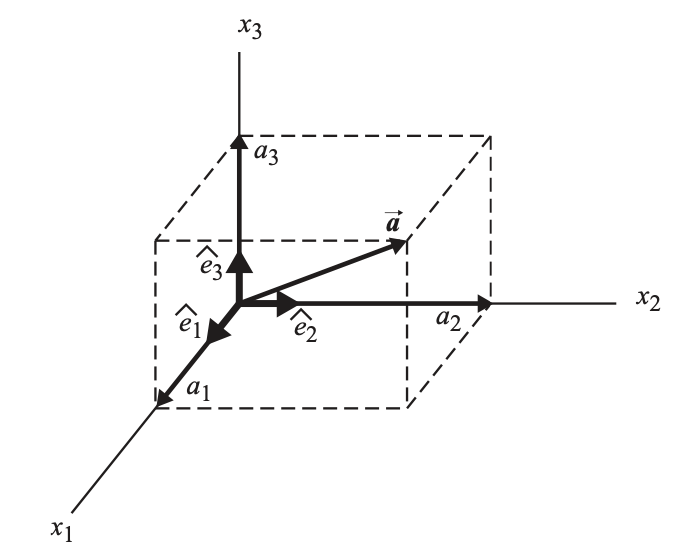

Before diving into the field of fluid mechanics, lets recap the basics of mathematical operators within vector calculus. For all purposes below and in all other articles we will assume a 3-D Cartesian coordinate system with x,y and z coordinates unless otherwise stated. To begin with we introduce the **Del** operator represented by the nabla symbol $\nabla$. Its standard definition is the derivative of a function and is defined as:

$$
\nabla = \left(\frac{\partial}{\partial x},\frac{\partial}{\partial y},\frac{\partial}{\partial z}\right) = \vec{e}_x\frac{\partial}{\partial x} + \vec{e}_y\frac{\partial}{\partial y} + \vec{e}_z\frac{\partial}{\partial z}  
$$

$\nabla$ can be interpreted as a vector of particle derivatives in each coordinate where $\{\vec{e}_x,\vec{e}_y,\vec{e}_z\}$  are the unit vectors in each coordinate. $\nabla$ is a mathematical notation to help easily understand the 4 main vector calculus operations, namely the gradient, divergence, curl and the laplacian. While there are many more operations possible using $\nabla$, for the purposes of fluids, these should be sufficient. In the case more operations are required, they will be explained.

- **Gradient operator**

  The gradient of a function $f$ points in the direction of greatest increase of $f$ and is represented as:
  
  $$
  \nabla f
  $$
  
  For the purposes regarding fluid mechanics we will show 2 possible uses of the gradient operator, one being the gradient of a scalar function $\nabla f$, and the other being the gradient of a vector function $\nabla\vec{f}$ where $\vec{f} = \{F_x,F_y,F_z\}$.
  
  $$
  \nabla f = \left(\frac{\partial f}{\partial x},\frac{\partial f}{\partial y},\frac{\partial f}{\partial z}\right) = \vec{e}_x\frac{\partial f}{\partial x} + \vec{e}_y\frac{\partial f}{\partial y} + \vec{e}_z\frac{\partial f}{\partial z}  
  $$
  
  
  $$
  \nabla\vec{f} = \begin{pmatrix} \frac{\partial F_x}{\partial x} & \frac{\partial F_x}{\partial y} & \frac{\partial F_x}{\partial z}\\ \frac{\partial F_y}{\partial x} & \frac{\partial F_y}{\partial y} & \frac{\partial F_y}{\partial z}\\ \frac{\partial F_z}{\partial x} & \frac{\partial F_z}{\partial y} & \frac{\partial F_z}{\partial z} \end{pmatrix}
  $$
  
  As we can see, the gradient of a scalar field is a rank 1 tensor i.e, a vector and the gradient of a vector field is a rank 2 tensor i.e, a matrix.
- **Divergence operator**

  The divergence of a vector field $\vec{f} = \{F_x,F_y,F_z\}$ shows how much is flowing out of a particular point i.e, source (result of the divergence is positive) and how much is flowing inside it i.e, sink (result of the divergence is negative). It is the measure of how many sources or sinks exist and its strength and is represented as:
  
  $$
  \nabla\cdot\vec{f} = \frac{\partial F_x}{\partial x} + \frac{\partial F_y}{\partial y} + \frac{\partial F_z}{\partial z}
  $$
  
  As shown from the above equation, the divergence of a vector field is a scalar value.
- **Curl operator**

  The curl of a vector field $\vec{f} = \{F_x,F_y,F_z\}$ shows the infinitesimal circulation of a vector field in a three-dimensional Euclidean space. It is represented as:
  
  $$\begin{eqnarray}
  \nabla\times\vec{f} & = & \left(\frac{\partial F_z}{\partial y} - \frac{\partial F_y}{\partial z}\right)\vec{e}_x + \left(\frac{\partial F_x}{\partial z} - \frac{\partial F_z}{\partial x}\right)\vec{e}_y\\\\\\
  & & + \left(\frac{\partial F_y}{\partial x} - \frac{\partial F_x}{\partial y}\right)\vec{e}_z
  \end{eqnarray}$$
  
  As shown from the above equation, the curl of a vector field is also a vector.
- **Laplacian operator**

  The laplacian operator is used in many fields and is performed most of the times on a scalar field. Intuitively imagine the laplacian operator to be the second derivative of a function $f$. It is represented as:
  
  $$
  \nabla^2 f = \nabla\cdot(\nabla f)
  $$
  
  The laplacian of a scalar field is a also a scalar field as seen from the above equation. The gradient of a scalar field is a vector and then performing a divergence on that vector field produces a scalar field.

- **Directional derivative**

  Finally lets take a look at something called the directional derivative which is a useful mathematical calculation in fluid mechanics. The directional derivative of a scalar field $f$ gives the rate of change of the field in a particular direction $\vec{a} = \{a_x,a_y,a_z\}$. It is represented as:
  
  $$
  \vec{a}\cdot\nabla f = a_x\frac{\partial f}{\partial x} + a_y\frac{\partial f}{\partial y} + \frac{\partial f}{\partial z}
  $$
  

While this brief recap on multivariable calculus should suffice for all other articles in this series. Listed below are further resources to help understand linear algebra and multivariable calculus.

  - [Linear algebra series on Youtube by 3blue1brown](https://www.youtube.com/playlist?list=PLZHQObOWTQDPD3MizzM2xVFitgF8hE_ab)
  - [Derivatives of multivariable functions on Khan academy](https://www.khanacademy.org/math/multivariable-calculus/multivariable-derivatives)

Performing vector calculus on multivariable functions can be a daunting task, especially in understanding the syntax and rules of the process. To make this task easier we use something called index notation (also called Einstein notation). This helps perform these calculations in a more easier manner, or atleast that is what I believe. Below we will review the rules used to write vector calculus in index notation.

- **Rules of Index notation**

Index notation is also commonly known as tensor or subscript notation. A very common technique when it comes to performing vector algebra.
<figure>
  
  <figcaption>Fig.1: An illustration of the 3-D coordinate system.</figcaption>
</figure>
Let's take a look at the figure above. Instead of the commonly defined $x,y$ and  $z$ we use $x_{1},x_{2}$ and $x_{3}$ or simply,
$$
x_i\;\;\text{where}\;\; i=1,2,3
$$
The corresponding unit basis vectors are
$$
\hat{e}_i\;\;\text{where}\;\; i=1,2,3
$$
These basis vectors $\hat{e}_{1},\hat{e}_{2}$ and $\hat{e}_{3}$ have the following properties:
$$
\begin{aligned}
&\hat{e}_{1}\cdot\hat{e}_{1}=\hat{e}_{2}\cdot\hat{e}_{2}=\hat{e}_{3}\cdot\hat{e}_{3}=1 \\\\
&\hat{e}_{1}\cdot\hat{e}_{2}=\hat{e}_{2}\cdot\hat{e}_{3}=\hat{e}_{1}\cdot\hat{e}_{3}=0
\end{aligned}
$$
We now introduce the Kronecker delta symbol $\delta_{ij}$. $\delta_{ij}$ has the following properties:
$$
\delta_{ij} = \begin{cases}0 & \text{if }i\neq j, \\\\
1 & \text{if }i=j.\end{cases}
$$
Using the above notation we can rewrite the product of the basis vectors as:
$$
\hat{e}_{i}\cdot\hat{e}_{j}=\delta_{ij}
$$

The standard vector notation approach for any vector $\overrightarrow{A}$ can be written as $\overrightarrow{A}=A_x\hat{i}+A_y\hat{j}+A_z\hat{k}$. We can express this using index notation as:

$$
\begin{aligned}
\overrightarrow{A}&=A_1\hat{e}_1+A_2\hat{e}_2+A_3\hat{e}_3 \\\\
&= \sum_{i=1}^3 A_i\hat{e}_i
\end{aligned}
$$

Notice that within the summation, the index $i$ is repeated. We call this a repeated index and these are always part of a summation. Hence from here on forward, a repeated index implies summation, and can be expressed as:

$$
\overrightarrow{A}=A_i\hat{e}_i=\sum_{i=1}^3 A_i\hat{e}_i
$$

This repeated index notation is known as Einstein's convention. Any repeated index is called a *dummy* index. Since a repeated index always implies a summation over all possible values, one can always relabel the *dummy* index:
$$
\overrightarrow{A} = A_i\hat{e}_i=A_j\hat{e}_j=A_k\hat{e}_k \text{  etc...}
$$

- **The scalar product in index notation**

We now show how to express scalar products (also known as inner or dot products) using index notation. Let's consider the vectors $\overrightarrow{a}$ and $\overrightarrow{b}$, which can be expressed using index notation as
$$
\begin{eqnarray}
\overrightarrow{a} = a_i\hat{e}_i\\\\
\overrightarrow{b} = b_j\hat{e}_j
\end{eqnarray}
$$
The dot product of these vectors $\overrightarrow{a}\cdot\overrightarrow{b}$ in a long form would give us:

$$
\begin{aligned}
\overrightarrow{a}\cdot\overrightarrow{b} &= \left(\sum_{i=1}^3{a_i\hat{e}_i}\right)\cdot\left(\sum_{j=1}^3{b_j\hat{e}_j}\right) \\\\
&=\sum_{i=1}^{3}\sum_{j=1}^{3}\left[\left(a_i\hat{e}_i\right)\cdot\left(b_j\hat{e}_j\right)\right] \\\\
&=\sum_{i=1}^{3}\sum_{j=1}^{3}\left[a_{i}b_{j}\left(\hat{e}_i\cdot\hat{e}_j\right)\right]\;\;\;\text{(commutative property)} \\\\
&=\sum_{i=1}^{3}\sum_{j=1}^{3}\left(a_{i}b_{j}\delta_{ij}\right)
\end{aligned}
$$

Summing over all values of $i$ and $j$ we get

$$
\begin{eqnarray}
\overrightarrow{a}\cdot\overrightarrow{b} &=& a_1b_1\delta_{11}+a_1b_2\delta_{12}+a_1b_3\delta_{13} \\\\
& & +a_2b_1\delta_{21}+a_2b_2\delta_{22}+a_2b_3\delta_{23} \\\\
& & +a_3b_1\delta_{31}+a_3b_2\delta_{22}+a_3b_3\delta_{33} \\\\
&=& a_1b_1\delta_{11}+a_2b_2\delta_{22}+a_3b_3\delta_{33} \\\\
&=& \sum_{i=1}^{3}a_ib_i
\end{eqnarray}
$$

More compactly we can write this as

$$
\begin{eqnarray}
\overrightarrow{a}\cdot\overrightarrow{b} &=& \left(a_i\hat{e}_i\right)\cdot\left(b_j\hat{e}_j\right) \\\\
&=& a_ib_j\hat{e}_i\cdot\hat{e}_j = a_ib_j\delta_{ij}\\\\
&=& a_ib_i = a_1b_1+a_2b_2+a_3b_3
\end{eqnarray}
$$


Lets take a look at some examples using scalar calculations:
1.  Reduce $\delta_{ij}\delta_{jk}\delta_{ki}$:
  
  $$
  \begin{eqnarray}
  \delta_{ij}\delta_{jk}\delta_{ki} &=& \delta_{ik}\delta_{ki} \text{ (remove }\delta_{ij}\text{, set }j=i\text{ everywhere)}\\\\
  &=& \delta_{ii} = 3 \text{ (remove }\delta_{ik}\text{, set }i=k\text{ everywhere)}
  \end{eqnarray}
  $$
  
2.  $\overrightarrow{r}$ and $\hat{r}$ in index notation:

    The vector $\overrightarrow{r}$ is expressed as:
    
    $$
    \overrightarrow{r} = x_1\hat{e}_1 + x_2\hat{e}_2 + x_3\hat{e}_3 = x_{i}\hat{e}_i
    $$
    
    The unit vector $\hat{r}$ is expressed as:
    
    $$
    \hat{r} = \frac{\overrightarrow{r}}{|\vec{r}|} = \frac{\overrightarrow{r}}{\left(\overrightarrow{r}\cdot\overrightarrow{r}\right)^{1/2}} = \frac{x_i\hat{e}_i}{\left(x_jx_j\right)^{1/2}}
    $$
    
    Lets take another case of a the scaler product of $\overrightarrow{a}\cdot\hat{r}$:
    
    $$
    \overrightarrow{a}\cdot\hat{r} = \frac{a_ix_i}{\left(x_jx_j\right)^{1/2}}
    $$
    

-   **The cross product in index notation**
Let's consider the same coordinate system shown in the figure above. Using conventional right-hand rule for cross products, we have
$$
\hat{e}_1\times\hat{e}_1 = \hat{e}_2\times\hat{e}_2 = \hat{e}_3\times\hat{e}_3 = 0
$$  
$$
\begin{eqnarray}
\hat{e}_1\times\hat{e}_2 &=& \hat{e}_3 \\\\
\hat{e}_2\times\hat{e}_3 &=& \hat{e}_1 \\\\
\hat{e}_3\times\hat{e}_1 &=& \hat{e}_2 \\\\
\hat{e}_2\times\hat{e}_1 &=& -\hat{e}_3 \\\\
\hat{e}_3\times\hat{e}_2 &=& -\hat{e}_1 \\\\
\hat{e}_1\times\hat{e}_3 &=& -\hat{e}_2 \\\\
\end{eqnarray}
$$

To write this using the index notation approach, we have to introduce a new symbol $\epsilon_{ijk}$, commonly known as the Levi-Cevita  tensor. This symbol has the following properties:
1.  Hello  
