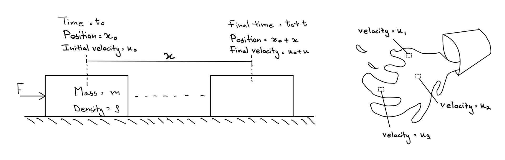

Fluid mechanics is a branch of physics that deals with the mechanics of fluids, including their motion and the forces acting on them. While in the case of solid mechanics, the whole body (a collection of molecules) is taken into account, fluids differ. A good starting point when studying fluids is understanding that each fluid molecule is accounted for seperately. This reason being that each individual molecule can have different motion (i.e. velocity) and magnitude of forces acting on them, compared to the other fluid molecules around them. Take the illustration shown below for a better understanding of how fluids react differently to solid bodies. As a force is applied to the solid body located at position $x_0$ and initial velocity $u_0$, each molecule within the body moves with the same velocity to the new position $x_0 + x$ and a final velocity $u_0 + u$. This shows that the complete solid body can be taken as one object of mass $m$ and density $\rho$. Now lets take a look at the case of a liquid flowing out of a container. As the liquid is flowing out, the velocity at each point of the liquid is different compared to the other. This means that, the liquid body cannot be taken as a single object.
<figure>
  
  <figcaption>Fig.1: An illustration depicting how solid bodies differ from liquid bodies under movement.</figcaption>
</figure>

Lets take a look at Newtons second law,

$$
F = m\cdot a
$$

For the case of the solid body, this becomes:

$$
F = m\cdot \frac{(u_0+u)-u_0}{(t_0+t)-t_0}
$$

Things are not as simple for the case with the liquid. Since we cannot take into account the complete liquid body as one, each region of the liquid needs to be solved for seperately. The definition of density $\rho$, is mass per unit volume. Since we are focused on a particular liquid volume, its mass is the density of the liquid itself. Therefore, Newtons second law for a liquid molecule becomes,

$$
F = \rho\cdot \frac{(u_0+u_1)-u_0}{(t_0+t)-t_0}
$$

The field of fluid mechanics helps us to understand the forces acting on the liquid in this case $F$, due to its viscosity, pressure and other additional external forces. For many, this is a good summary of what fluid mechanics entails. However, for the curious minded, a more deeper understanding of fluid mechanics is shown below, outlined as several seperate articles, each explaining the many intricacies of how the equations of motion of the fluid can be derived. Furthermore, many more concepts are explained as shown below forming a basis for turbulent flows and more complex topics within the realm of fluid dynamics. 
